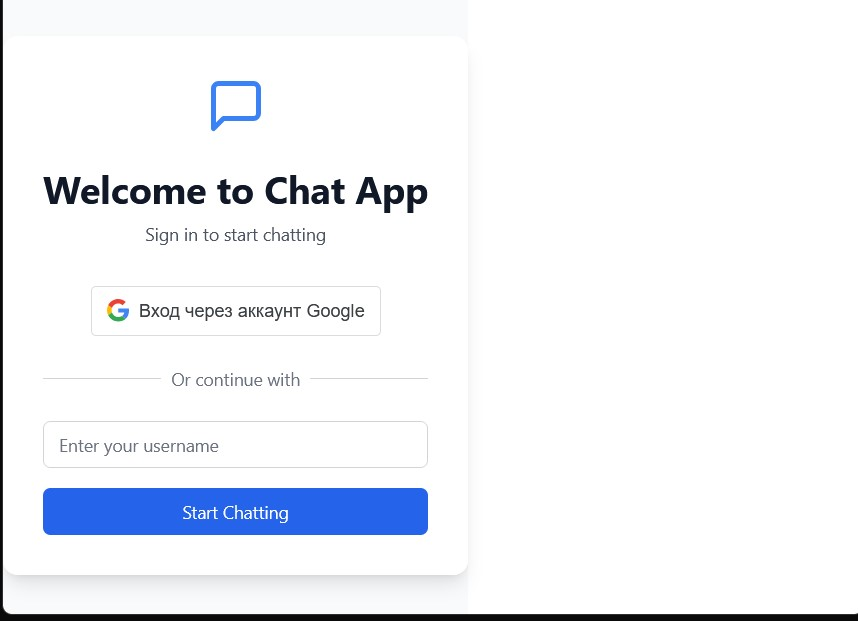
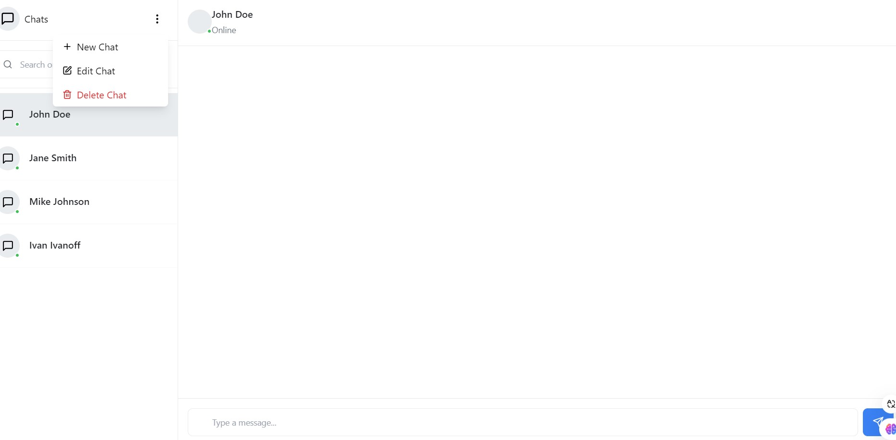

# chatReenbit

A full-stack real-time chat application built with React, TypeScript, Node.js, Express, and MongoDB.

---

## Table of Contents

- [Project Structure](#project-structure)
- [Getting Started](#getting-started)
- [How It Works](#how-it-works)
- [Main Features](#main-features)
- [Configuration](#configuration)
- [Dependencies](#dependencies)
- [Screenshots](#screenshots)
- [License](#license)

---

## Project Structure

```
chatReenbit-main/
├── .env
├── .env.example
├── .gitignore
├── README.md
├── backend/
│   ├── config/
│   │   └── db.js
│   ├── controllers/
│   │   ├── chatController.js
│   │   └── messageController.js
│   ├── middleware/
│   │   └── auth.js
│   ├── models/
│   │   ├── Chat.js
│   │   ├── Message.js
│   │   └── User.js
│   ├── routes/
│   │   ├── chatRoutes.js
│   │   └── messageRoutes.js
│   ├── server.js
│   └── utils/
│       └── quotable.js
├── eslint.config.js
├── index.html
├── loginWindow.jpg
├── main-chat.jpg
├── node_modules/
├── package-lock.json
├── package.json
├── postcss.config.js
├── src/
│   ├── App.tsx
│   ├── components/
│   │   ├── ChatDialog.tsx
│   │   ├── ChatList.tsx
│   │   ├── ChatWindow.tsx
│   │   └── Login.tsx
│   ├── config/
│   │   ├── auth.ts
│   │   └── constants.ts
│   ├── index.css
│   ├── main.tsx
│   ├── store/
│   │   └── useStore.ts
│   ├── styles/
│   │   ├── chat.module.css
│   │   └── reset.css
│   ├── types/
│   │   └── index.ts
│   ├── utils/
│   │   ├── api.ts
│   │   └── auth.ts
│   └── vite-env.d.ts
├── tailwind.config.js
├── tsconfig.app.json
├── tsconfig.json
├── tsconfig.node.json
└── vite.config.ts
```

---

## Getting Started

### Prerequisites

- Node.js (v18+ recommended)
- npm or yarn
- MongoDB instance (local or cloud)

### Installation

1. **Clone the repository:**
   ```bash
   git clone <repo-url>
   cd chatReenbit-main
   ```

2. **Install dependencies:**
   ```bash
   npm install
   # or
   yarn install
   ```

3. **Configure environment variables:**
   - Copy `.env.example` to `.env` and fill in the required values (e.g., MongoDB URI, JWT secret).

4. **Start the backend server:**
   ```bash
   npm run server
   ```
   The backend will start on the port specified in your `.env` file (default: 5000).

5. **Start the frontend (React app):**
   ```bash
   npm run dev
   ```
   The frontend will start on [http://localhost:5173](http://localhost:5173) by default.

---

## How It Works

- **Frontend:** Built with React and TypeScript, using Vite for fast development. State management is handled by Zustand. The UI is styled with Tailwind CSS and custom CSS modules.
- **Backend:** Node.js with Express serves as the API and real-time server (via Socket.IO). MongoDB is used for data persistence, with Mongoose for object modeling.
- **Authentication:** JWT-based authentication, with middleware to protect API routes. Google OAuth integration is supported.
- **Real-time Messaging:** Socket.IO enables real-time chat between users, with chat and message data stored in MongoDB.
- **API:** RESTful endpoints for user authentication, chat management, and message handling.

---

## Main Features

- User registration and login (with Google OAuth option)
- Real-time chat with multiple users
- Chat list and chat window interfaces
- Persistent message history
- JWT-secured API endpoints
- Responsive UI

---

## Configuration

- `.env`: Contains sensitive environment variables (see `.env.example` for template).
- `backend/config/db.js`: MongoDB connection logic.
- `backend/middleware/auth.js`: JWT authentication middleware.

---

## Dependencies

**Frontend:**
- React, React DOM, React Router DOM
- Zustand (state management)
- date-fns (date utilities)
- sonner (notifications)
- lucide-react (icons)
- Tailwind CSS, PostCSS

**Backend:**
- Express
- Mongoose
- Socket.IO
- CORS
- dotenv
- jsonwebtoken, bcryptjs

**Shared:**
- axios (HTTP requests)
- ajv (JSON schema validation)

See `package.json` for the full list.

---

## Screenshots




---

## License

This project is licensed under the MIT License.

---

## Additional Notes

- The project is ready for deployment. You can build the frontend using `npm run build` and serve it with any static file server.
- The backend can be extended with additional features such as file uploads, group chats, or advanced notification systems.
- For development, both frontend and backend can run concurrently. Make sure your `.env` is properly configured for CORS and database access.

---

If you have any questions or need further setup help, please refer to the code comments or open an issue in the repository.

[Edit in StackBlitz next generation editor ⚡️](https://stackblitz.com/~/github.com/wagJoker/chatReenbit)